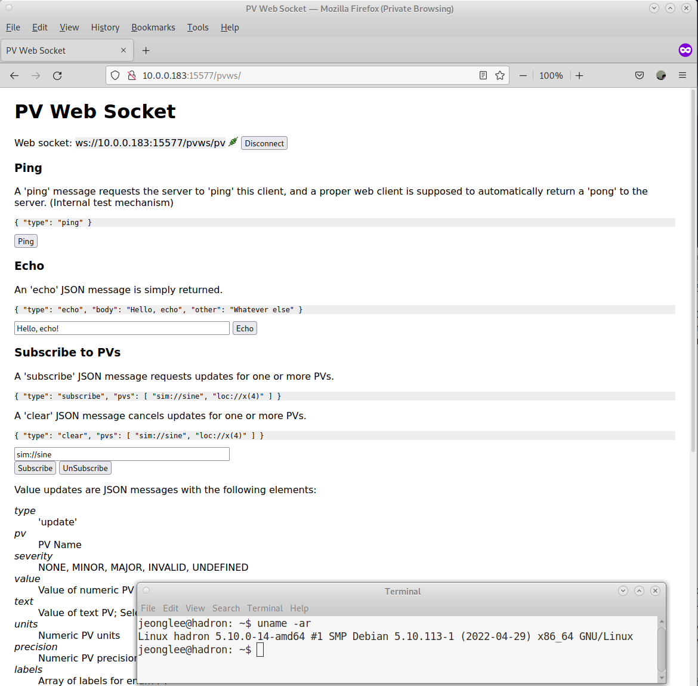

# EPICS PV WebSocket Configuration Environment

Configuration Environment for [EPICS PV WebSocket](https://github.com/ornl-epics/pvws) for [the Advanced Light Source (ALS) and Upgrade (ALS-U) Project](https://als.lbl.gov/als-u/overview/) at [Lawrence Berkeley National Laboratory](https://lbl.gov).

## Please

One should understand that 
- This repository is a **simple tool** to help users to setup, maintain, and upgrade EPICS PV WebSocket easily.

## Pre-requirement packages

### Debian 11

```bash
git make sudo which curl wget libjson-pp-perl 
```


### JAVA and MAVEN

Default JAVA and MAVEN configuration are for Debian 11. Please set JAVA and MAVEN according to your system.

Please check several rules in `configure/RULES_REQ` for preparation of your own JAVA and MAVEN environment.
Note that `JAVA_HOME`,`JAVA_PATH`, `MAVEN_HOME`, and `MAVEN_PATH` must be defined without any variables.

### Tomcat9

We don't need the Tomcat service running, but does the package itself. The default Tomcat9 is for the Debian 11.
Please check several Makefile rules for Tomcat9 such as `make tomcat.......`

```bash
$ make vars FILTER=TOMCAT_

------------------------------------------------------------
>>>>          Current Environment Variables             <<<<
------------------------------------------------------------

TOMCAT_DEFAULT_PORT = 8083
TOMCAT_DEFAULT_SERVER_XML = server.xml
TOMCAT_HOME = /usr/share/tomcat9
TOMCAT_INSTALL_LOCATION = /opt/tomcat9
TOMCAT_MAJOR_VER = 9
TOMCAT_MINOR_VER = 0.58
TOMCAT_SRC = apache-tomcat-9.0.58.tar.gz
TOMCAT_URL = "https://archive.apache.org/dist/tomcat/tomcat-9/v9.0.58/bin/apache-tomcat-9.0.58.tar.gz"
TOMCAT_VER = 9.0.58
```


## EPICS Environment Variables

The default EPICS Environment Variables are defined as

```bash
% make vars FILTER=EPICS_

------------------------------------------------------------
>>>>          Current Envrionment Variables             <<<<
------------------------------------------------------------

EPICS_CA_ADDR_LIST = localhost
EPICS_CA_AUTO_ADDR_LIST = YES
EPICS_CA_MAX_ARRAY_BYTES = 16384
EPICS_PVA_ADDR_LIST =
EPICS_PVA_AUTO_ADDR_LIST = YES
EPICS_PVA_BROADCAST_PORT = 5076
EPICS_PVA_NAME_SERVERS =
EPICS_CA_ADDR_LIST = localhost
EPICS_CA_AUTO_ADDR_LIST = YES
EPICS_CA_MAX_ARRAY_BYTES = 16384
```

## Build, install, and Service

* 
```
make init
make build
make install
make exist
make exist LEVEL=3
```

## SystemD

```
$ make sd_enable
$ make sd_start
$ make sd_status
$ systemctl status  pvws
● pvws.service - EPICS PV WebSocket for ALS
     Loaded: loaded (/opt/pvwebsocket/pvws.bash; enabled; vendor preset: enabled)
     Active: active (running) since Fri 2022-05-13 21:25:51 PDT; 3min 26s ago
       Docs: https://github.com/ornl-epics/pvws
    Process: 10258 ExecStart=/bin/bash -c /opt/pvwebsocket/pvws.bash startup (code=exited, status=0/SUCCESS)
   Main PID: 10270 (java)
      Tasks: 41 (limit: 9341)
     Memory: 348.1M
        CPU: 15.227s
     CGroup: /system.slice/pvws.service

```

##
* https://localhost:15577/pvws/

## Scripts

Note that `USER` should be in `USERID` or `GROUPID`. Typically, in Linux, `USER` should be in the tomcat group. One can use `sudo` permission to run the following script. However, please keep in mind that systemd is executed by tomcat account. If one starts it with `sudo` permission at first, systemd cannot do. In this case, `chown -R tomcat:tomcat /opt/pvwebsocket` is required to recover this issue.

```
/opt/pvwebsocket/pvws.bash startup
/opt/pvwebsocket/pvws.bash shutdown
/opt/pvwebsocket/pvws.bash status
/opt/pvwebsocket/pvws.bash info
```

It is convenient to add `USER` to tomcat group by `sudo usermod -aG tomcat $USER`.

## Screenshot


||
| :---: |
|**Figure 1** Firefox PV WebSocker Home Page Screenshot.|
